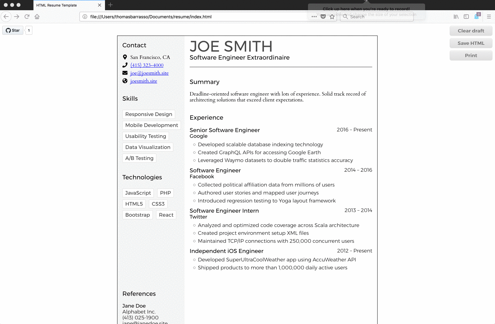

# html-resume-template

Single-page resume template built using HTML, CSS, and JS that can be viewed on the web or exported to a PDF.

## Editing

This template has the ability to edit, and automatically save, inside the browser! Elements are dynamically marked with `contenteditable`, allowing you to change the text, add and remove bullet points, etc.

The below example is from Firefox (61): adding several list items then refreshing the page.

## Sample

## Flexibility

This template can be editted both in HTML and CSS. Just like with [CSS Zen Garden](http://www.csszengarden.com/), you can fully customize the layout and style to suit your needs.

## TODO

- Add feedback when page is saved (or an error occurs)
- Allow custom file names for saved HTML
- Support [Prince](https://www.princexml.com/)

## Acknowledgements

This project uses [normalize.css](https://github.com/necolas/normalize.css), fonts from [Google Fonts](https://fonts.google.com/), and icons from [Font Awesome](https://fortawesome.github.io/Font-Awesome/). Dependencies are managed as links to CDNs, no package managers or build tools required. Built by me, [Tom Barrasso](https://barrasso.me).

## Compatibility

Tested on Chrome (67) and Firefox (61) on mac OS (10.13.5).
This software uses `localStorage`, `template`, flexbox, and custom properties and is intended for modern browsers.